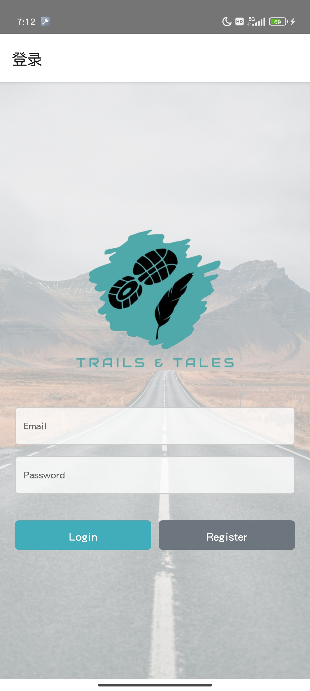
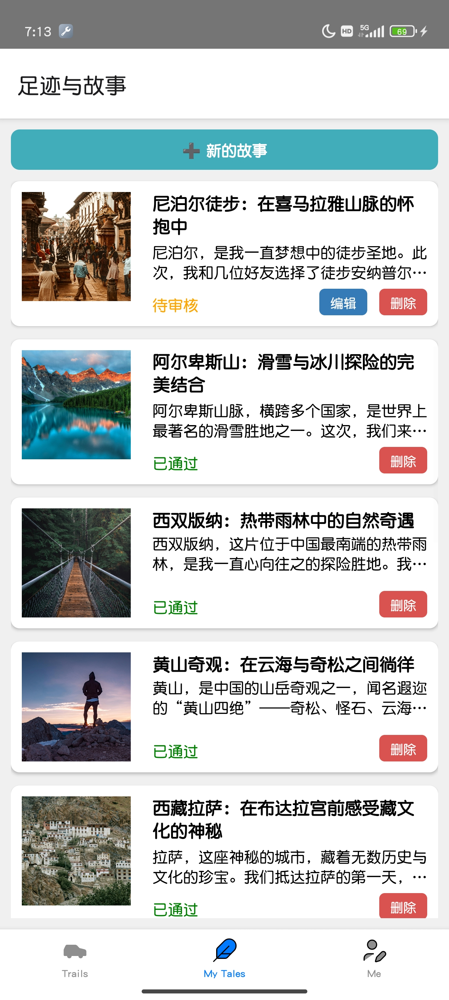
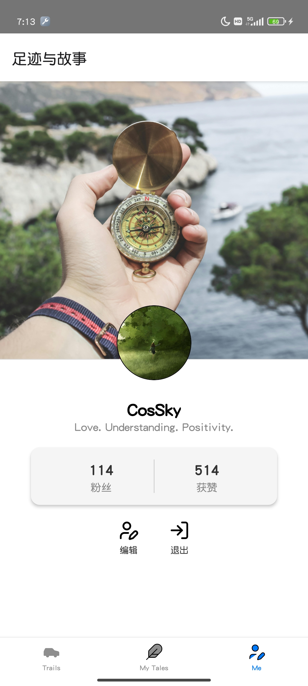
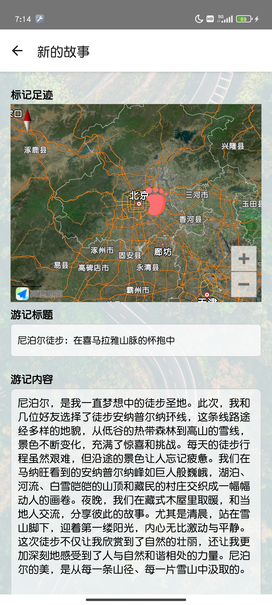
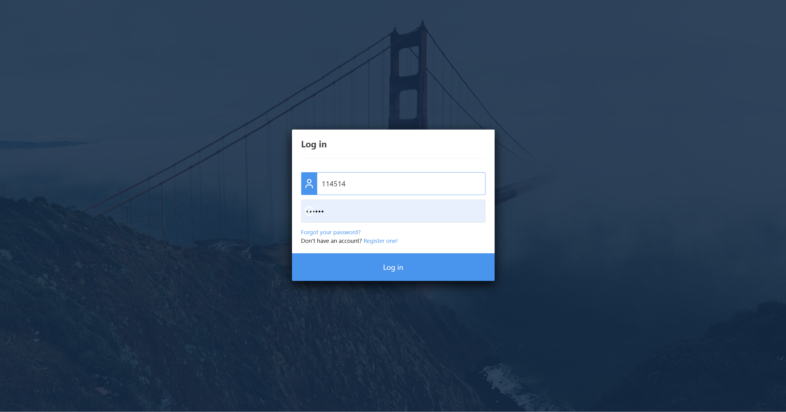
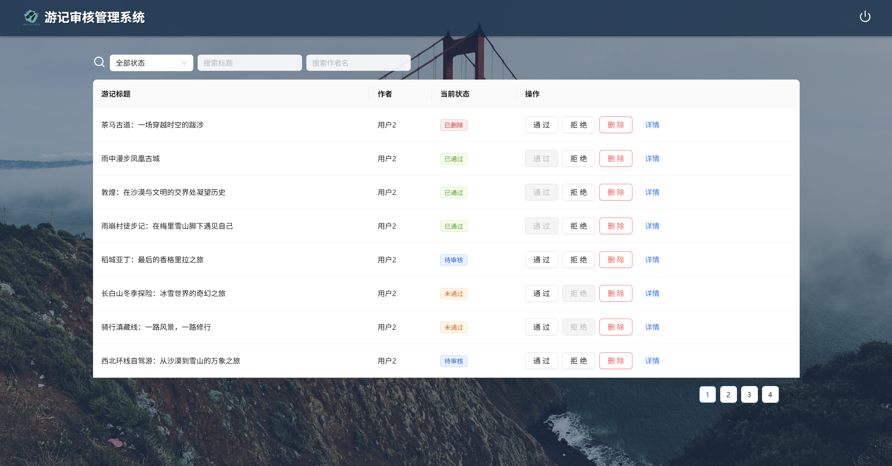

# Trails & Tales

`Trails & Tales`（足迹与故事）是一款基于 React、React-Native 开发的跨平台游记记录应用，支持图文发布、视频播放等多重功能，后端基于 Node.js；目前仅适用于 Android 平台和 Web 端应用。


## ✨ 功能特性

- 📝 游记管理：发布、编辑、删除自己的游记，支持图文与视频内容
- 📋 审核系统：展示审核状态（待审核、已通过、未通过），未通过提供原因反馈
- 🔍 搜索功能：支持关键字搜索和分页加载
- 📽 视频体验：支持 WiFi 自动播放、小窗播放、全屏播放、离开暂停
- 🖼 瀑布流样式列表与详情页浏览
- ☁ 文件上传：接入阿里云 OSS，上传图片与视频
- 🔐 用户登录认证：支持 JWT 登录状态管理，Redux 管理全局状态


## 📷 截图展示

> 登陆页面



> 主界面


> 我的游记页面



> 个人档案页面



> 游记发布页面



> （网页端）登录页面



> （网页端）主界面




## 🛠 技术栈

- **前端**：`React`、`React Native`、`Redux`、`Axios`；
- **后端**：`Node.js`、`Express`、`JWT`、`MySQL`；
- **存储服务**：阿里云OSS（Object-Storage-Service）


## 📦 安装与运行

### 1. 克隆项目

```bash
git clone https://github.com/CosineSky/2025-Trails-Tales.git
cd 2025-Trails-Tales
```

### 2. 安装依赖

```bash
cd server
npm install
cd ../client-web
npm install
cd ../client_mobile
npm install
cd ..
```

### 3. 配置环境变量

请在根目录下创建 `.env` 文件，配置以下内容：

```properties
API_BASE_URL=https://your-api-url.com
OSS_REGION=your-region
OSS_ACCESS_KEY_ID=your-access-key-id
OSS_ACCESS_KEY_SECRET=your-access-key-secret
OSS_BUCKET=your-bucket-name
```

### 4. 启动应用

服务端：

```bash
cd server
node index.js
```

客户端（Web）：

```bash
cd client-web
react-scripts start
```

客户端（移动端）：

```bash
cd client_mobile
react-native run-android
```


## 📁 项目结构（部分）

服务端：

```
├── db_migrations                   # 数据库迁移/同步文件
│       ├── models                  # 数据模型
│       │     ├── users.js         
│       │     ├── journals.js
│       │     └── ...
│       └── init.js                 # 初始化数据库文件
├── routes                          # 路由信息
│   ├── app                         # 供移动端应用接口
│   │    ├── users      
│   │    │     └── ... 
│   │    ├── utils
│   │    │     └── ... 
│   │    └── ...
│   └── management                  # 供web端接口
│           ├── login.js         
│           ├── register.js
│           └── journals
│                   └── ...
├── index.js                        # 服务端入口
├── db.js                           # 数据库配置文件
├── package.json
├── package-lock.json
├── ......
└── README.md
```

客户端（Web）：

```
├── src                             # 数据库迁移/同步文件
│    ├── assets                     # 静态资源
│    │     └── images         
│    │           └── ...
│    ├── pages                      # 页面（路由）
│    │     ├── Home      
│    │     │     └── ...   
│    │     ├── Login
│    │     │     └── ...
│    │     └── Register
│    │           └── ...
│    ├── App.js                     # 应用入口
│    ├── App.css                    # 应用全局样式
│    ├── index.js                   # web端入口
│    ├── LoginRegister.css          # 登录/注册页通用样式
│    └── ...
├── package.json
├── package-lock.json
├── ......
└── README.md
```

客户端（移动端）：

```
├── src                             # 数据库迁移/同步文件
│    ├── assets                     # 静态资源
│    │     ├── icons         
│    │     │     └── ...
│    │     └── images         
│    │           └── ...
│    ├── components                 # 公用组件
│    │     ├── Button.tsx   
│    │     ├── Input.tsx  
│    │     └── ...  
│    ├── pages                      # 页面（路由）
│    │     ├── main      
│    │     │     ├── Home.tsx   
│    │     │     ├── Story.tsx   
│    │     │     └── ...   
│    │     ├── Detail.tsx
│    │     ├── Edit.tsx
│    │     └── ...
│    ├── navigation                 # 页面导航
│    │     ├── AppNavigator.tsx   
│    │     └── MainTabNavigator.tsx  
│    ├── services                   # 后端服务接口
│    │     ├── authService.ts   
│    │     ├── profileService.ts   
│    │     └── ...  
│    ├── ...   
│    └── App.tsx                    # 应用入口
├── android                         # 安卓设备配置
│      └── ...  
├── ios                             # ios设备配置
│    └── ...  
├── app.json                        # 应用配置文件
├── index.js                        # 移动端应用入口
├── tsconfig.json                   # typescript配置文件
├── package.json
├── package-lock.json
├── ......
└── README.md
```


## ✅ 待办事项（TODO）

-  游记评论功能
-  游记分类与标签筛选
-  地理定位与地图标记


## 🤝 贡献指南

欢迎提 issue、发 PR，一起让项目更完善！


## 📄 License

- 这里空空如也。